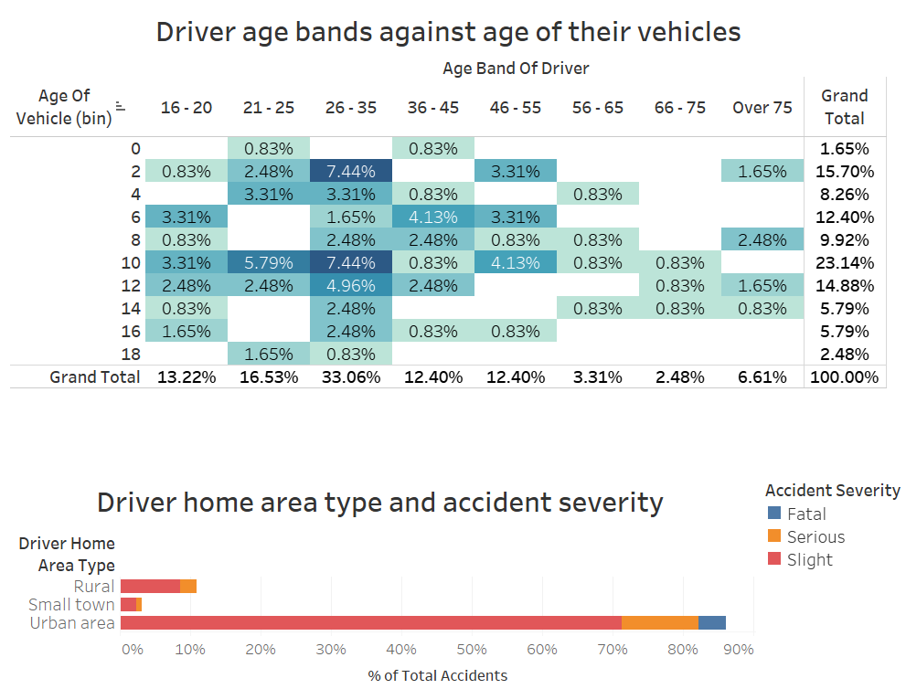

# Pipeline overview
This project is your fully automated pipeline to donwload road traffic accidents datasets from a Kaggle, transform them and load into a PostgreSQL database with a predefined schema.
The config.yaml is to let you setup database connection details; the other settings are enforced by the description of the task.

- [Pipeline overview](#pipeline-overview)
- [Prerequisites](#prerequisites)
- [How to run the script](#how-to-run-the-script)
- [How to query the data](#how-to-query-the-data)
- [Tools](#tools)
- [Any data quality practices you would enforce](#any-data-quality-practices-you-would-enforce)
- [How you would test for correctness](#how-you-would-test-for-correctness)
- [Dashboard](#dashboard)

# Prerequisites
Make sure you have an installation of
- PostgreSQL 11
- Python 3.7

# How to run the script
1. Open the command line
2. Create a Python virtual environment
```
virtualenv stuart
```
3. Activate the virtualenv
```
.\stuart\Scripts\activate - for Windows
source stuart/bin/activate - for Mac OS / Linux
```
4. Install the required modules
```
pip install -r requirements.txt
```
5. Make sure to register with Kaggle and follow the instructions on [this link](https://github.com/Kaggle/kaggle-api#api-credentials) to get your credentials through the kaggle.json onto your system.

6. Check the config.yaml file in the working directory. Change the following settings to apply for your setup
```
    db_host : localhost
    db_port : 5432
    db_user: user_with_create_db_rights
    db_pass: pass
    
    # Database to be created and then utilized
    db_name : stuart
```

7. You can now run the python script:
```
python .\traffic_accidents_pipe.py
```

# How to query the data
Once the pipeline is through, you can connect to the DB server and database you have specified earlier in the config.yaml.
```
--statement to present fact table data joined with its dimensions
SELECT 
	accident_index, 
	accident_severity, 
	date, 
	day_of_week, 
	age_band_of_driver, 
	age_of_vehicle, 
	journey_purpose_of_driver, 
	driver_home_area_type
FROM recent_accidents
JOIN dim_accident_severity USING(accident_severity_id)
JOIN dim_age_band_of_driver USING(age_band_of_driver_id)
JOIN dim_driver_home_area_type USING(driver_home_area_type_id)
JOIN dim_journey_purpose_of_driver USING(journey_purpose_of_driver_id)
ORDER BY accident_index;

--statement to show dimension tables and their fields
SELECT table_name, column_name 
FROM information_schema.columns 
WHERE table_name ~ 'dim_';
```

# Tools
- Python: With pandas, yaml and psycopg2 modules it has all the ingridients to pipe this amount of data in a swift manner.
- Yaml config: as a way to expose variables and give more dynamic feel.
- db_schema.sql: since the dimensions with the data are static, it allows for a scenario where PostgreSQL makes sure dimenions are there and the Python script only has to look them up.
- Tableau: has compatibility with growing amount of data sources including PostgreSQL. Great tool for vizualizations and live dashboards.

# Any data quality practices you would enforce
- temporal completeness (establish any possibility for gaps)
- validating data against a set of expectations for certain fields (e.g. age_of_vehicle should not be above N years; numerical fields could not be < 0 where appropriate)
- the day_of_week column is sourced from the raw data even though it could be derived from the date itself. Any discrepancies between the two could be checked with:
```
select
	COUNT(*) - sum(case when trim(to_char(date, 'Day')) = day_of_week then 1 else 0 END) as wrong_day_of_week_cases
from recent_accidents;
```

# How you would test for correctness
* To make sure all string value are present in the dimension tables we could follow up with a check on the fact table foreign keys.
```
SELECT 
	count(*) - count(accident_severity_id) as missing_severity_count, 
	count(*) - count(age_band_of_driver_id) as missing_age_band_count,
	count(*) - count(driver_home_area_type_id) as missing_home_area_type_count,
	count(*) - count(journey_purpose_of_driver_id) as missing_journey_purpose_count
FROM recent_accidents;
```
* if we are using the full outer join of accidents and vehicles
    * number of accidents we don't have vehicles / per date;
    * number of accident indices present in vehicles data but not in accidents data / per date;

# Dashboard
  For the vizualization part you could open viz_stuart.twb Tableau workbook, enter your database details and browse throught the dashboard.
  
  